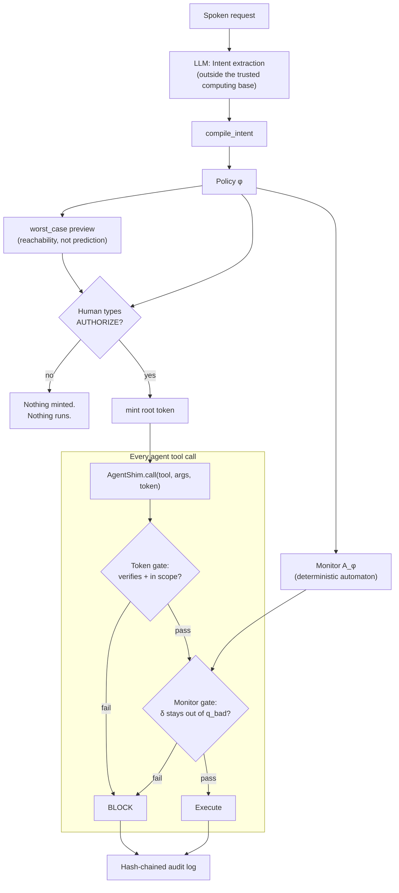

# VDP — Verifiable Delegation Protocol

VDP is a protocol and reference implementation for **bounding what a
delegated agent can do**, with a guarantee that holds even against a fully
adversarial agent:

> For every finite sequence of actions the agent actually executes, that
> sequence is not a bad prefix of the authorized policy φ.

In plain terms: a human authorizes a spend cap, a whitelist of recipients,
and a hard prohibition — VDP guarantees the agent can never step outside
those bounds, no matter what it tries. It does **not** guarantee the agent
does the job well, honestly, or at all. See
[DESIGN.md §0](DESIGN.md#0-what-vdp-claims-and-what-it-does-not) for exactly
where the line is drawn, on purpose.

This repository is the **reference implementation** (Python 3.11+, standard
library only on the enforcement path) of [`vdp-spec-0.3`](SPEC.md). It is
one conforming implementation, not the protocol itself — see
[SPEC.md](SPEC.md) if you're building another one.

## Why

Delegating a task to an LLM agent (pay bills, manage a calendar, spend a
budget) means giving it real capability. Prompting it to "be careful" is not
a bound. VDP compiles a human-authorized policy into a finite-state monitor
that mediates every action the agent takes, so the bound is enforced by an
automaton, not by the agent's judgment.

## How it works



- **Policy (φ)** — a small safety-fragment language: spend caps, recipient
  whitelists, hard prohibitions. No `eventually`, no "make sure it succeeds":
  liveness properties cannot be expressed, so they cannot be silently
  approximated. See [SPEC.md §2](SPEC.md#2-policy-language).
- **Monitor** — φ compiles to a deterministic finite automaton. Every action
  is checked against it before execution; a blocked action never advances
  monitor state. The "no bad prefix" guarantee is a proof about this
  automaton, not a heuristic. See [SPEC.md §3](SPEC.md#3-monitor-automaton-a_φ).
- **Worst-case preview** — before a human confirms anything, VDP computes and
  shows the actual worst case the policy permits (reachability over the
  automaton, not a prediction of agent behavior). See
  [SPEC.md §4](SPEC.md#4-worst-case-preview).
- **Attenuable tokens** — an agent can delegate to a sub-agent only by
  narrowing its own scope (a lattice meet). No caveat, however adversarial,
  can widen a token. This is unconditional; an HMAC chain separately prevents
  forging or stripping caveats from a token you don't hold. See
  [SPEC.md §5](SPEC.md#5-attenuable-capability-tokens).
- **Audit log** — every decision, allowed or blocked, is written to an
  append-only, hash-chained log. Replay recomputes every transition
  independently. Honest about its limits: tampering is detected, not
  prevented; tail truncation is undetectable without an external anchor (see
  [SECURITY.md](SECURITY.md)). See [SPEC.md §6](SPEC.md#6-audit-log).

## Quickstart

Requires Python 3.11+. The enforcement path is standard-library only, so
installing VDP pulls in nothing. Optional extras: `test` (`pytest`,
`hypothesis`), `attest` (`cryptography`, needed only for
`runtime.attest.Ed25519Attestor`).

```bash
pip install -e ".[test]"        # or: pip install -e ".[dev,attest]"

# A well-behaved agent doing its job within bounds:
python -m demo.payment_agent

# The same policy under attack — cap-splitting, token forgery, scope
# widening, log tampering, and seven more. Every attack must be blocked:
python -m demo.hostile_agent

# Full test suite (property-based + adversarial fuzzing + unit):
pytest
```

`demo.payment_agent` walks the full pipeline end to end: a spoken request
containing one wish VDP *cannot* enforce (rejected honestly, not
approximated), a worst-case preview, a scripted human confirmation, three
allowed payments, and a verified audit log.

## Module layout

```
policy/     ast.py  parser.py  compile.py  render.py  llm_prompt.py  confirm.py
monitor/    automaton.py  mediate.py  worstcase.py
tokens/     scope.py  macaroon.py
runtime/    shim.py  auditlog.py  attest.py  server.py  client.py
demo/       payment_agent.py  hostile_agent.py
tests/      test_policy.py  test_monitor.py  test_tokens.py  test_runtime.py
            test_properties.py  test_adversarial.py  test_server.py  test_attest.py
            test_conformance.py  test_hardening.py
```

`test_conformance.py` replays the portable vectors in
[`spec/conformance/`](spec/conformance/) — the same fixtures SPEC.md §10
gives a second implementation — so this implementation is held to its own
published artifacts. `test_hardening.py` covers what a hostile peer or a
crash reaches: request-line bounds, connection timeouts and caps, and that a
record is on disk before `append()` returns.

## Documentation

| Document | What's in it |
|---|---|
| [SPEC.md](SPEC.md) | Normative protocol spec — wire formats, grammar, decision procedures. Read this to implement VDP in another language. |
| [DESIGN.md](DESIGN.md) | Rationale, proofs, worked examples. Read this to understand *why* the spec is shaped the way it is. |
| [SECURITY.md](SECURITY.md) | Threat model, trust boundary, known gaps, how to report a vulnerability. |
| [CHANGELOG.md](CHANGELOG.md) | Spec revision history and open design questions. |

## What VDP does not do

VDP does not guarantee the delegated task completes, that the agent is
honest, that the agent spends less than the authorized worst case, or that
the downstream executor (a bank, an API) honors a decision it was given.
Retries, task-completion tracking, reputation, anomaly scoring, and rollback
are deliberately absent — each would imply a guarantee VDP cannot make. See
[DESIGN.md §0](DESIGN.md#0-what-vdp-claims-and-what-it-does-not).

## License

Apache-2.0 — see [LICENSE](LICENSE).
